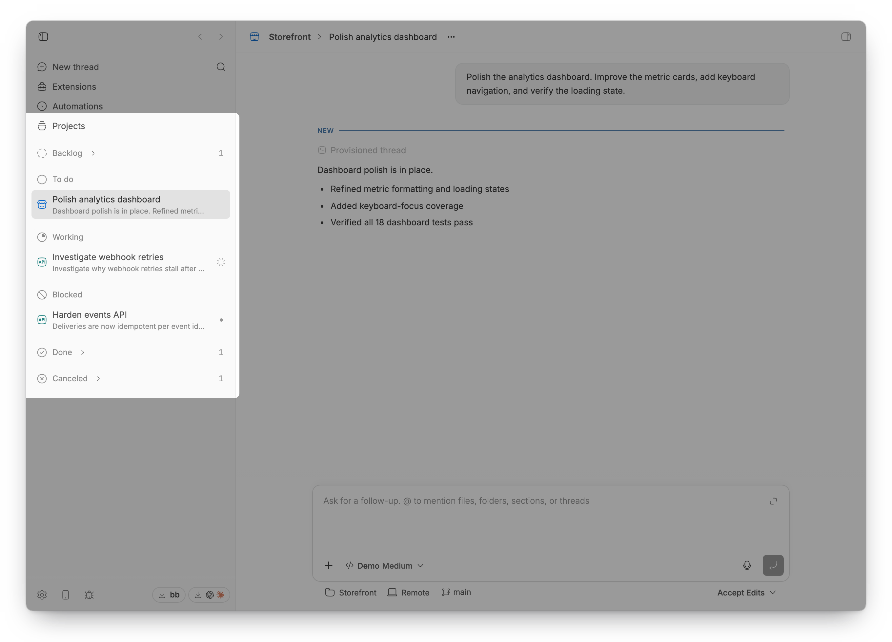

<h1 align="center"><a href="https://github.com/ariofrio">Andres Riofrio</a>'s bb plugins</h1>

<p align="center"><strong>Plugins for <a href="https://getbb.app">bb</a>, the agent IDE that builds itself</strong></p>

<p align="center">
  <a href="https://getbb.app"></a>
  <a href="LICENSE"></a>
  <a href="https://github.com/ariofrio/bb-plugins/actions/workflows/plugins.yml"></a>
</p>

<br>

<p align="center"><a href="plugins/bb-plugin-thread-stages#readme"><picture><source media="(prefers-color-scheme: dark)" srcset="plugins/bb-plugin-thread-stages/assets/screenshot-dark.png"></picture></a></p>

### Organization

-  **[Thread stages](plugins/bb-plugin-thread-stages#readme)** — Group threads in the sidebar into stages from Backlog to Done, updating as they run.
-  **[Project icons](plugins/bb-plugin-project-icons#readme)** — Give each project an icon and color.

### Navigation

-  **[Project breadcrumbs](plugins/bb-plugin-project-breadcrumbs#readme)** — Show and manage a thread's project from its header.
-  **[Missing keyboard shortcuts](plugins/bb-plugin-missing-keyboard-shortcuts#readme)** — Add shortcuts to start personal or project threads, navigate history, and reach the composer or panel tabs.

### Themes

-  **[ChatGPT theme](plugins/bb-plugin-chatgpt-theme#readme)** — Restyle bb to match the OpenAI ChatGPT (Codex) desktop app.

## Install

Add this repository as a bb marketplace, then choose any of its plugins in
Settings → Plugins:

```sh
bb marketplace add git:github.com/ariofrio/bb-plugins@main
```

The marketplace tracks each plugin's Git release tags, so new releases appear
without re-adding it. Its catalog is defined in
[marketplace.json](marketplace.json).

To install one plugin directly from `main`, follow its README, or select it
from the repository's plugin collection:

```sh
bb plugin install git:https://github.com/ariofrio/bb-plugins.git@main --plugin chatgpt-theme
```

The available collection names are listed in [.bb/plugins.json](.bb/plugins.json).
Nothing here is published to npm yet.

## Development

Clone the repository and install every plugin at once:

```sh
git clone https://github.com/ariofrio/bb-plugins.git
cd bb-plugins
npm run install:plugins
```

Run the same command after a `git pull`: it installs whatever is missing, then
rebuilds and reloads every plugin.

### Releases

Create a Changeset with `npm run changeset` for every user-visible plugin
change. After the change reaches `main`, automation opens or updates a release
pull request with version, lockfile, and changelog updates. Merging that pull
request validates the affected plugins, creates immutable `<plugin-id>/vX.Y.Z`
Git tags, and publishes a
[GitHub release](https://github.com/ariofrio/bb-plugins/releases) per tag
carrying that version's changelog entry. Every listing accepts any released
version, so the catalog never changes with a release.

`npm run release:check` runs each plugin's tests, type checks, build, SDK
declaration verification, and packed artifact verification.
[CI](.github/workflows/plugins.yml) runs the same check for every plugin. Build
output in `dist/` is generated and is not committed.

## License

[MIT](LICENSE)
