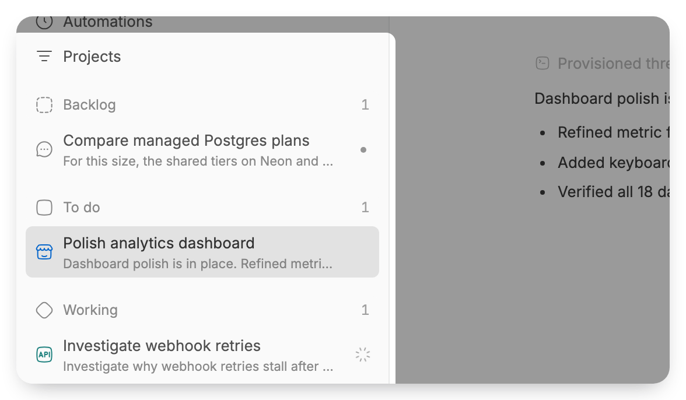
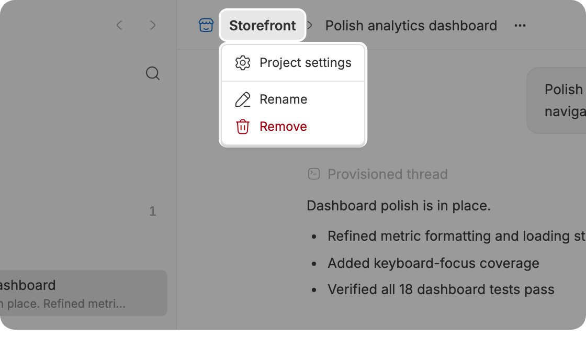
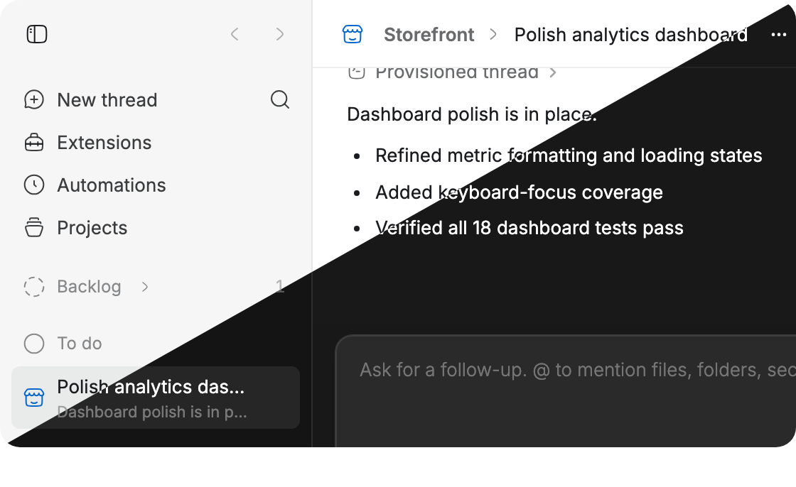
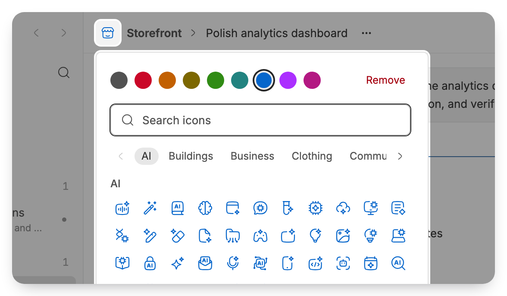
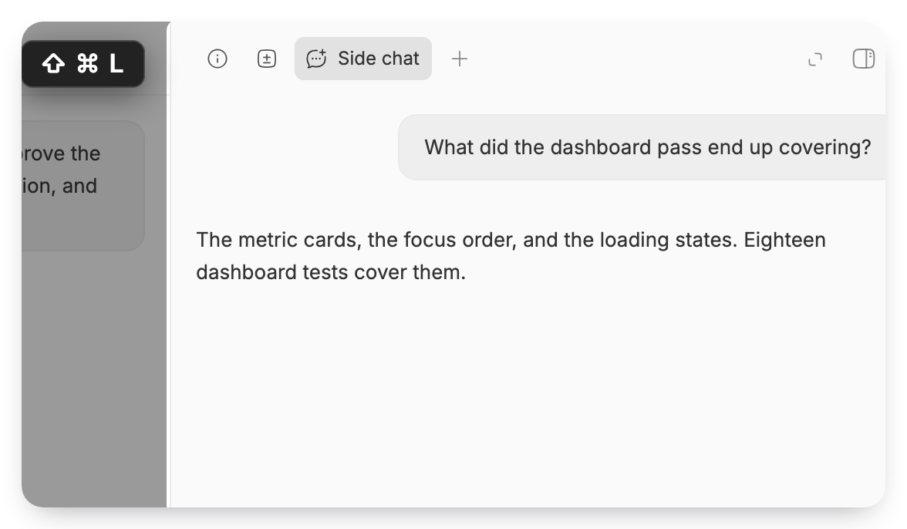

<h1 align="center"><a href="https://github.com/ariofrio">Andres Riofrio</a>'s bb plugins</h1>

<p align="center"><strong>Plugins for <a href="https://getbb.app">bb</a>, the agent IDE that builds itself</strong></p>

<p align="center">
  <a href="https://getbb.app"></a>
  <a href="LICENSE"></a>
  <a href="https://github.com/ariofrio/bb-plugins/actions/workflows/plugins.yml"></a>
</p>

<br>

<table>
  <thead>
    <tr>
      <th align="center" width="33%">Organization</th>
      <th align="center" width="33%">Navigation</th>
      <th align="center" width="33%">Themes</th>
    </tr>
  </thead>
  <tbody>
    <tr>
      <td valign="top" align="center">
        <p><a href="plugins/bb-plugin-thread-stages#readme"><picture><source media="(prefers-color-scheme: dark)" srcset="plugins/bb-plugin-thread-stages/assets/card-dark.png"></picture></a></p>
        <p><a href="plugins/bb-plugin-thread-stages#readme"><br><strong>Thread stages</strong></a></p>
        <p>Group threads in the sidebar into stages from Backlog to Done, updating as they run.</p>
        <p></p>
      </td>
      <td valign="top" align="center">
        <p><a href="plugins/bb-plugin-breadcrumbs#readme"><picture><source media="(prefers-color-scheme: dark)" srcset="plugins/bb-plugin-breadcrumbs/assets/card-dark.png"></picture></a></p>
        <p><a href="plugins/bb-plugin-breadcrumbs#readme"><br><strong>Breadcrumbs</strong></a></p>
        <p>Show a thread's section, project, and ancestors in its header.</p>
        <p></p>
      </td>
      <td valign="top" align="center">
        <p><a href="plugins/bb-plugin-chatgpt-theme#readme"><picture><source media="(prefers-color-scheme: dark)" srcset="plugins/bb-plugin-chatgpt-theme/assets/card-dark.png"></picture></a></p>
        <p><a href="plugins/bb-plugin-chatgpt-theme#readme"><br><strong>ChatGPT theme</strong></a></p>
        <p>Restyle bb to match the OpenAI ChatGPT (Codex) desktop app.</p>
        <p></p>
      </td>
    </tr>
    <tr>
      <td valign="top" align="center">
        <p><a href="plugins/bb-plugin-icons#readme"><picture><source media="(prefers-color-scheme: dark)" srcset="plugins/bb-plugin-icons/assets/card-dark.png"></picture></a></p>
        <p><a href="plugins/bb-plugin-icons#readme"><br><strong>Icons</strong></a></p>
        <p>Give each project and section an icon and color.</p>
        <p></p>
      </td>
      <td valign="top" align="center">
        <p><a href="plugins/bb-plugin-missing-keyboard-shortcuts#readme"><picture><source media="(prefers-color-scheme: dark)" srcset="plugins/bb-plugin-missing-keyboard-shortcuts/assets/card-dark.png"></picture></a></p>
        <p><a href="plugins/bb-plugin-missing-keyboard-shortcuts#readme"><br><strong>Missing keyboard shortcuts</strong></a></p>
        <p>Add shortcuts to start personal or project threads, navigate history, and reach the composer or panel tabs.</p>
        <p></p>
      </td>
      <td></td>
    </tr>
  </tbody>
</table>

## Install

Add this repository as a bb marketplace, then choose any of its plugins in
Settings → Plugins:

```sh
bb marketplace add git:github.com/ariofrio/bb-plugins
```

Or install one of them from the command line:

```sh
bb plugin install chatgpt-theme@ariofrio
```

The entry ids are `breadcrumbs`, `chatgpt-theme`, `icons`,
`missing-keyboard-shortcuts`, and `thread-stages`, and each plugin's
README repeats its own. Every entry resolves the plugin's highest
`<entry-id>/vX.Y.Z` release tag, so `bb plugin update <entry-id>` picks up new
releases and the marketplace never has to be re-added. Its catalog is defined
in [marketplace.json](marketplace.json). Nothing here is published to npm yet.

## Development

Clone the repository and install every plugin at once:

```sh
git clone https://github.com/ariofrio/bb-plugins.git
cd bb-plugins
npm run install:plugins
```

Run the same command after a `git pull`: it installs whatever is missing, then
rebuilds and reloads every plugin.

To run one plugin's unreleased code without a checkout, install it from `main`
by its collection name — the names are listed in
[.bb/plugins.json](.bb/plugins.json):

```sh
bb plugin install git:https://github.com/ariofrio/bb-plugins.git@main --plugin chatgpt-theme
```

That install follows the branch rather than the release tags, so
`bb plugin update <plugin-id>` moves it to the newest commit on `main`.

### Releases

Create a Changeset with `npm run changeset` for every user-visible plugin
change. After the change reaches `main`, automation opens or updates a release
pull request with version, lockfile, and changelog updates. Merging that pull
request validates the affected plugins, creates immutable `<plugin-id>/vX.Y.Z`
Git tags, and publishes a
[GitHub release](https://github.com/ariofrio/bb-plugins/releases) per tag
carrying that version's changelog entry. Every listing accepts any released
version, so the catalog never changes with a release.

`npm run release:check` runs each plugin's tests, type checks, build, SDK
declaration verification, and packed artifact verification.
[CI](.github/workflows/plugins.yml) runs the same check for every plugin. Build
output in `dist/` is generated and is not committed.

## License

[MIT](LICENSE)
