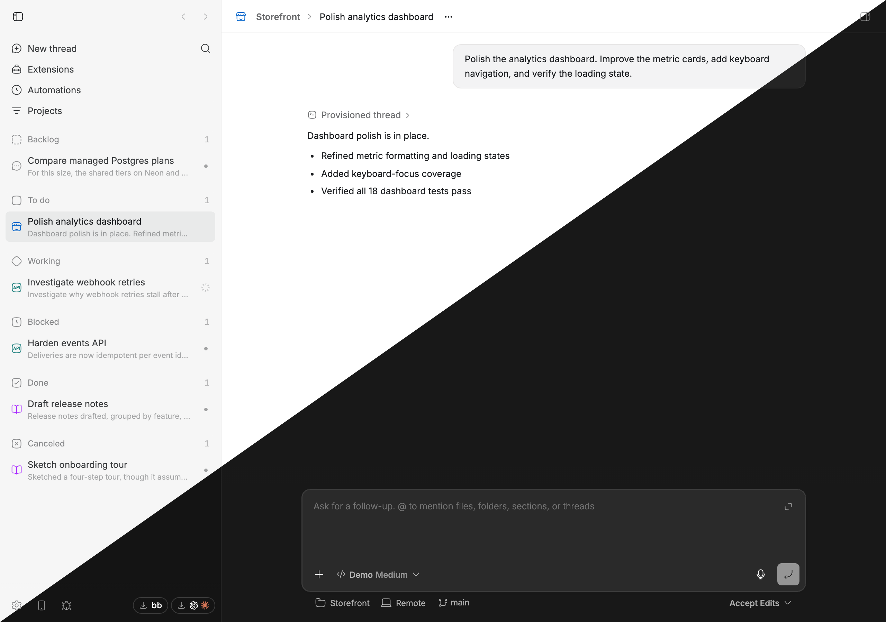

# ChatGPT theme

An unofficial [bb](https://getbb.app) theme that closely matches the OpenAI
ChatGPT (née Codex) desktop app. Its colors and shadows are based on computed
styles from corresponding rendered leaves in both light and dark mode.

This theme deliberately does not change the dimensions, shapes, or positions
of any elements. Those are explicitly outside its scope.

## Preview

Both palettes at once, meeting along the diagonal, with the mode this page is
being read in in the top-left corner.

<picture>
  <source media="(prefers-color-scheme: dark)" srcset="assets/screenshot-dark.png">
  
</picture>

## Install

Add this repository as a bb marketplace, then install the theme from it and
select it:

```sh
bb marketplace add git:github.com/ariofrio/bb-plugins
bb plugin install chatgpt-theme@ariofrio
bb theme set plugin:chatgpt-theme:chatgpt
```

Skip the first line if you already added the marketplace for another plugin.

Installing the plugin makes the palette available under Settings → Appearance;
it does not activate the palette automatically. To update it later:

```sh
bb plugin update chatgpt-theme
```

bb keeps light/dark appearance as a separate per-client setting; this single
theme supports both.

MIT licensed. Codex, ChatGPT, and OpenAI are trademarks of OpenAI; this project
is not affiliated with or endorsed by OpenAI.
