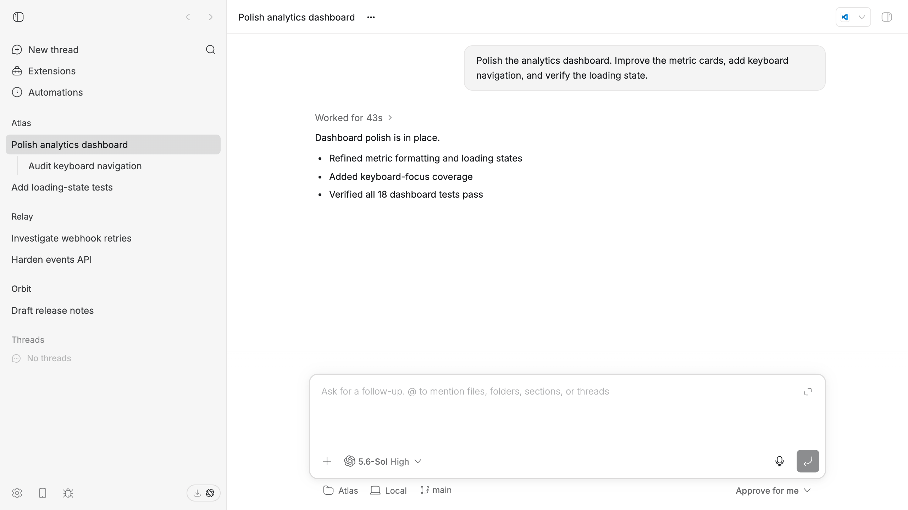

# ChatGPT theme

An unofficial [bb](https://getbb.app) theme that closely matches the OpenAI
ChatGPT (née Codex) desktop app. Its colors and shadows are based on computed
styles from corresponding rendered leaves in both light and dark mode.

This theme deliberately does not change the dimensions, shapes, or positions
of any elements. Those are explicitly outside its scope.

## Preview

**Light**



**Dark**


## Install

```sh
bb plugin install git:https://github.com/ariofrio/bb-plugins.git@main --plugin chatgpt-theme
bb theme set plugin:chatgpt-theme:chatgpt
```

Installing the plugin makes the palette available under Settings → Appearance;
it does not activate the palette automatically. To update it later:

```sh
bb plugin update chatgpt-theme
```

bb keeps light/dark appearance as a separate per-client setting; this single
theme supports both.

MIT licensed. Codex, ChatGPT, and OpenAI are trademarks of OpenAI; this project
is not affiliated with or endorsed by OpenAI.
