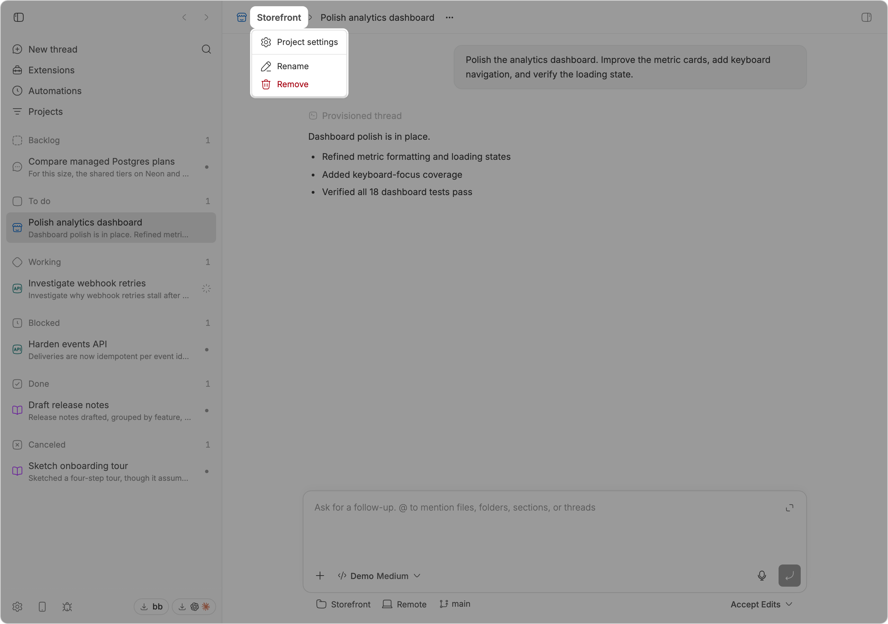

# Project breadcrumbs

Adds the current project to each standard-project thread header:

```text
bb-plugins  >  Add project breadcrumbs
```

<picture>
  <source media="(prefers-color-scheme: dark)" srcset="assets/screenshot-dark.png">
  
</picture>

The project name uses the same muted, hoverable treatment as bb's project
settings breadcrumb. The existing thread title node is left in place, so it
retains bb's normal-weight thread-header typography.

Clicking the project name opens a menu containing:

- Project settings
- Rename
- Remove

Project settings navigates inside bb's router. Rename and Remove use
version-matched bb dialog components and call the plugin backend, which applies
the mutation through bb's project SDK. The actions do not depend on the
sidebar or its project menu being mounted.

## Implementation

The plugin registers `experimental_threadHeaderAction` to receive the current
project and read its live name from `experimental_useSidebarThreads()`. Its
otherwise-hidden slot inserts a React portal immediately before bb's existing
thread-title container. The frontend action dialogs call schema-validated RPC
handlers registered by `src/server.ts` for project rename and removal.

This deliberately relies on bb's private thread-header DOM structure because
the plugin SDK has no title-prefix slot. `src/header-dom.test.ts` documents and
tests the expected structure so a future bb header change fails locally rather
than silently changing the thread title.

Personal-project threads are left unchanged because they do not have the
standard Project settings/Rename/Remove action set.

## Install

Add this repository as a bb marketplace, then install the plugin from it:

```sh
bb marketplace add git:github.com/ariofrio/bb-plugins
bb plugin install project-breadcrumbs@ariofrio-bb-plugins
```

Skip the first line if you already added the marketplace for another plugin.

Update an installed copy with:

```sh
bb plugin update project-breadcrumbs
```

## Development

```sh
npm run release:check
bb plugin reload project-breadcrumbs
```

`release:check` runs the tests and typecheck, checks the committed SDK
declarations are current, builds, and installs the packed npm artifact in a
temporary directory to validate its contents. `dist/` is built, never
committed. The package is not published to npm yet, but it stays publishable
so it can be.

## License

[MIT](LICENSE)
